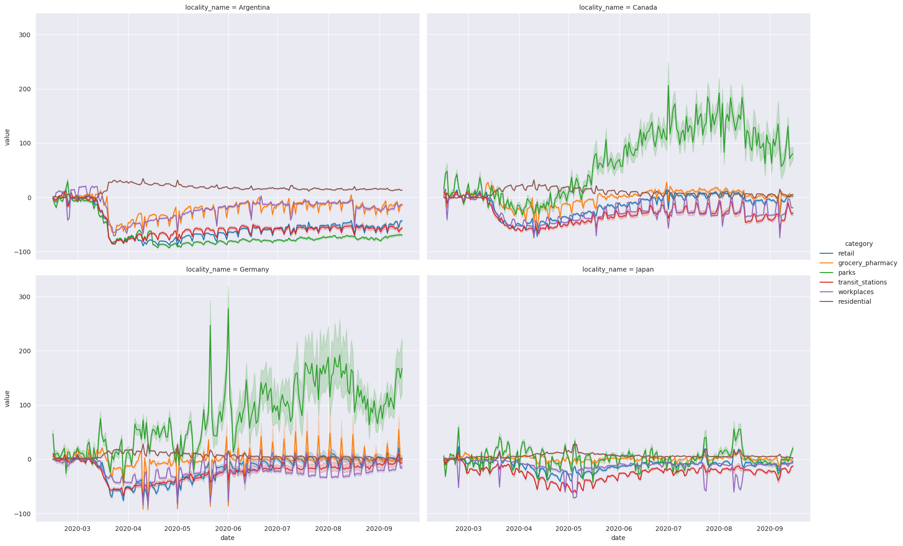
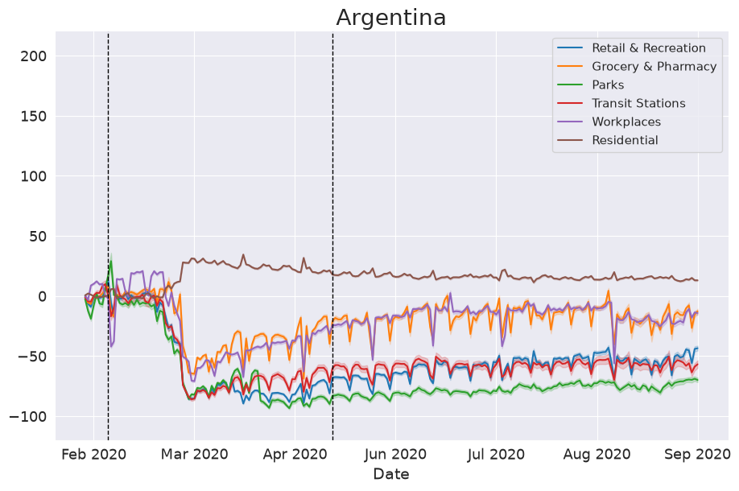

+++
title = "A guide to setting up seaborn FacetGrid and relplot charts"
date = "2020-08-15"
aliases = ["/posts/matplotlib-searborn-replot/"]
tags = ["python", "data-visualization"]
+++

Using seaborn and matplotlib to make great plots isn’t easy. I had been looking on the internet for complete tutorials on how to set up a good plot, but I only found small pieces of code. So here are a few tips for plotting data with the Google Global Mobility Report and matplotlib.

<!--more-->

> **Update, August 2026.** The mobility report has changed since I wrote this. It gained a `place_id` column, and it now covers February 2020 to October 2022, when Google stopped publishing it — I was working with the first six months. The code below accounts for both: the `melt` calls name `value_vars`, and the data is cut back to the window the plots were made for.

The whole thing is in [this Colab notebook](https://colab.research.google.com/drive/1uoqxox1vMnOseLjNM-VYKObCEH3j5qXO?usp=sharing) if you want to run it while you read. Let’s start by importing the libraries we need.

```python
from datetime import datetime

import matplotlib.dates as mdates
import matplotlib.pyplot as plt
import pandas as pd
import seaborn as sns
```

Now we can read the data:

```python
google_mobility_url = (
    "https://www.gstatic.com/covid19/mobility/Global_Mobility_Report.csv?"
)
dt_original = pd.read_csv(google_mobility_url, low_memory=False, parse_dates=["date"])
```

I’m going to rename a few columns and select a group of countries to plot the data.

```python
column_names = {
    "retail_and_recreation_percent_change_from_baseline": "retail",
    "grocery_and_pharmacy_percent_change_from_baseline": "grocery_pharmacy",
    "parks_percent_change_from_baseline": "parks",
    "transit_stations_percent_change_from_baseline": "transit_stations",
    "workplaces_percent_change_from_baseline": "workplaces",
    "residential_percent_change_from_baseline": "residential",
    "country_region": "locality_name"
}
data = dt_original.rename(columns=column_names)

# the six columns we actually want to plot
value_columns = ["retail", "grocery_pharmacy", "parks", "transit_stations", "workplaces", "residential"]

# filter the data and drop unnecessary columns
regions = ["Japan", "Canada", "Germany", "Argentina"]
columns_to_drop = ["census_fips_code", "metro_area", "iso_3166_2_code", "sub_region_1", "sub_region_2", "country_region_code"]
data = data.query(f"locality_name in {regions}").drop(columns=columns_to_drop)

# the plots below cover the first months of the pandemic
data = data[data["date"] <= "2020-09-15"]
```

We have the data we need. Now we can build a simple plot to show the values of all categories over time. One thing to be careful about here: `melt` takes every column that isn’t an `id_var`, so it pays to name the value columns. A stray text column mixed in with the numbers makes matplotlib read the y axis as categorical and fail with a `TypeError`.

```python
# melt turns the category columns into rows. Naming value_vars matters: without
# it, melt takes every column that isn't an id_var, and any leftover text column
# ends up mixed in with the numbers.
long_data = data.melt(
    id_vars=["locality_name", "date"],
    value_vars=value_columns,
    var_name="category",
    value_name="value",
)
long_regions_plot = sns.relplot(
    x="date",
    y="value",
    hue="category",
    data=long_data,
    col="locality_name",
    col_wrap=2,
    kind="line",
    height=6,
    legend="brief",
    aspect=1.5,
    markers=True,
    dashes=True,
)
```



Looks good! But I can’t read the title, the legend is small, and so are the axis labels.

The shaded bands around each line are worth a word too. The query keeps every row for those countries, the national ones and the sub-regional ones, so each line is the mean across all of them and the band is the confidence interval seaborn draws around it. If you want the national numbers on their own, keep the rows where `sub_region_1` is empty.

## Making it readable

One thing to know before fixing any of that: `relplot` doesn’t give you back an Axes, it gives you a [FacetGrid](https://seaborn.pydata.org/generated/seaborn.FacetGrid.html) — a grid of subplots sharing a single legend. That is why the rest of the code loops over `.axes` instead of calling `plt` once, and why the legend needs handling of its own.

First, the style. It can be any one of `white`, `dark`, `whitegrid`, `darkgrid` or `ticks`:

```python
sns.set_style('darkgrid', {'legend.frameon': True})
```

I narrowed this plot down to Argentina, because further down I want to mark the dates its restrictions started and eased:

```python
data_to_plot = data.melt(
    id_vars=["locality_name", "date"],
    value_vars=value_columns,
    var_name="category",
    value_name="value",
).query('locality_name == "Argentina"')

argentina_plot = sns.relplot(
    x="date",
    y="value",
    hue="category",
    data=data_to_plot,
    col="locality_name",
    col_wrap=2,
    kind="line",
    height=6,
    legend="brief",
    aspect=1.5,
    markers=True,
    dashes=True,
)
```

Now the legend. The FacetGrid one sits outside the grid, so I drop it and build a per-subplot legend instead, with labels that read like English:

```python
pretty_labels = {
    "retail": "Retail & Recreation",
    "grocery_pharmacy": "Grocery & Pharmacy",
    "parks": "Parks",
    "transit_stations": "Transit Stations",
    "workplaces": "Workplaces",
    "residential": "Residential",
}

argentina_plot._legend.remove()

# .flat so this works whether or not col_wrap is set
for ax in argentina_plot.axes.flat:
    ax.set(xlabel='Date', ylabel='')

    handles, labels = ax.get_legend_handles_labels()
    if handles:
        # pair every handle with its own label instead of slicing by position:
        # older seaborn returned the hue title as the first handle, newer ones
        # don't, and slicing shifts every label by one when that changes
        pairs = [(handle, pretty_labels[label])
                 for handle, label in zip(handles, labels)
                 if label in pretty_labels]
        ax.legend(
            handles=[handle for handle, _ in pairs],
            labels=[label for _, label in pairs],
            title="",
            fontsize=11,
            title_fontsize=11,
        )

    # make x and y-axis labels slightly larger
    ax.set_xlabel(ax.get_xlabel(), fontsize=14)
    ax.set_ylabel(ax.get_ylabel(), fontsize=14)

    # make the title more human-readable and larger
    if ax.get_title():
        final_txt = ax.get_title().split('=')[1].strip().capitalize()
        ax.set_title(final_txt, fontsize=20)

    # one tick every five weeks, labelled with month and year -- '%b' alone
    # repeats itself once the range covers more than a single year
    ax.xaxis.set_major_formatter(mdates.DateFormatter('%b %Y'))
    ax.xaxis.set_major_locator(mdates.WeekdayLocator(interval=5))
```

Last, the two dashed lines for the restriction dates, plus the tick size and a fixed range for the y axis so the plot doesn’t rescale itself when the data changes:

```python
restriction_date = datetime.strptime('2020-03-20', '%Y-%m-%d')
ease_restriction_date = datetime.strptime("2020-05-11", '%Y-%m-%d')

plt.axvline(restriction_date, color='k', linestyle='dashed', linewidth=1)
plt.axvline(ease_restriction_date, color='k', linestyle='dashed', linewidth=1)

plt.tick_params(axis='both', labelsize=13)

axes = plt.gca()
axes.set_ylim([-120, 220])
```

Both dates are Argentina’s: mandatory isolation took effect on 20 March 2020 ([DNU 297/2020](https://www.boletinoficial.gob.ar/detalleAviso/primera/227042/20200320)), and restrictions started easing on 11 May.

Those last few calls go through `plt.gca()`, so they only touch the current subplot. That is fine here because Argentina is the only one, but if you plot the four countries again you need to move them inside the loop, the same way as everything else.

And that gives us this:



Same data, same seaborn call, just a readable version of it.
